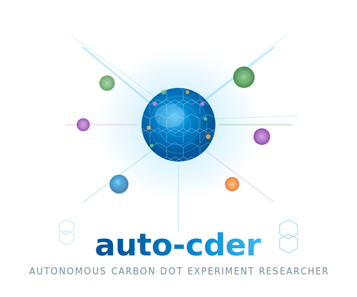

# Auto-CDer

<div align="center">



**Autonomous Carbon Dot Experiment Researcher**

*End-to-end autonomous scientific discovery for carbon dot (CD) nanomaterials — from hypothesis generation to experimental validation, with persistent self-evolving memory.*

[](LICENSE)
[](https://www.python.org/downloads/)
[](https://docs.astral.sh/uv/)

</div>

---

## Overview

Auto-CDer adapts [EvoScientist](https://github.com/EvoScientist/EvoScientist)'s end-to-end scientific discovery framework to **carbon dot (CD) research** — the synthesis, characterization, and application of fluorescent carbon nanomaterials.

Given a user goal $G^{CD} = (\text{Precursor}, \text{Property}, \text{Application})$, Auto-CDer autonomously:

1. **Retrieves** CD literature via Semantic Scholar + PubMed
2. **Generates** 21 candidate synthesis hypotheses via Idea Tree Search
3. **Ranks** ideas by Synthesis Novelty, Feasibility, Relevance, and Protocol Clarity
4. **Executes** a 5-stage CD experiment pipeline (Synthesis → Purification → Characterization → Application → Reproducibility)
5. **Evolves** its knowledge through three self-evolution mechanisms (CD-IDE, CD-IVE, CD-ESE)

The more experiments Auto-CDer runs, the better its proposals become — the memory system is the moat.

---

## Architecture

```
User Goal G^CD
     │
     ▼
┌──────────────────┐     ┌──────────────────┐
│ Researcher Agent  │────▶│  Engineer Agent   │
│  (Idea Gen)       │     │  (5-Stage Exec)   │
│  • Lit Retrieval  │     │  • Synthesis      │
│  • Idea Tree Srch │     │  • Purification   │
│  • Elo Tournament │     │  • Characterize   │
│  • Proposal Ext   │     │  • Application    │
└────────┬─────────┘     │  • Reproducibility│
         │               └────────┬─────────┘
         │                        │
         ▼                        ▼
┌──────────────────────────────────────────┐
│        Evolution Manager Agent            │
│  CD-IDE ◄──► M_I^CD (Ideation Memory)     │
│  CD-IVE ◄──► M_I^CD (Validation)          │
│  CD-ESE ◄──► M_E^CD (Experimentation)     │
└──────────────────────────────────────────┘
```

See [docs/design.md](docs/design.md) for the complete mathematical formulation (16 equations), architecture diagrams, and EvoScientist comparison.

---

## Skills

Auto-CDer ships with 5 core skills:

| Skill | Description | Stages |
|---|---|---|
| [cd-synthesis](skills/cd-synthesis/) | CD synthesis protocol generation | Precursor analysis → doping → method → conditions → protocol |
| [cd-characterization](skills/cd-characterization/) | Characterization pipeline | Optical → structural → surface chemistry → data processing → report |
| [cd-application](skills/cd-application/) | Application validation | Selection → protocol → execution → analysis → benchmark |
| [cd-memory](skills/cd-memory/) | Persistent research memory | Retrieval → CD-IDE → CD-IVE → CD-ESE → update |
| [cd-literature](skills/cd-literature/) | Literature retrieval & gap analysis | Disambiguation → discovery → filtering → deep read → gap analysis |

### Install a skill

```
auto-cder /install-skill auto-cder/skills@cd-synthesis
```

Skills are composable — use them individually or chain them for end-to-end CD research.

---

## Quick Start

### Prerequisites

- Python 3.11+
- [uv](https://docs.astral.sh/uv/) package manager
- API keys: Gemini (idea gen), Anthropic (code gen), Semantic Scholar (literature)

### Installation

```bash
# Clone
git clone https://github.com/auto-cder/auto-cder.git
cd auto-cder

# Install dependencies
uv sync --dev

# Set up API keys
cp .env.example .env
# Edit .env with your keys

# Onboard
uv run auto-cder onboard
```

### Run

```bash
# CLI (terminal)
uv run auto-cder

# WebUI (browser)
uv run auto-cder webui

# Mobile API server
uv run auto-cder serve --mobile
```

### Example Goal

```
auto-cder> Synthesize high-QY N,S co-doped carbon dots from citric acid
          and thiourea for selective Hg²⁺ sensing in water samples
```

Auto-CDer will:
1. Search 46+ CD papers
2. Generate 21 candidate synthesis hypotheses
3. Elo-rank and select top-3
4. Execute 5-stage experiment pipeline
5. Report: QY, TEM size, LOD, selectivity, reproducibility
6. Update M_I^CD and M_E^CD for future tasks

---

## Documentation

| Document | Description |
|---|---|
| [Design Specification](docs/design.md) | Full 16-equation formulation, architecture diagrams, table analysis |
| [CLI Interface](docs/ui/cli.md) | Terminal UI design with 5 screen mockups |
| [WebUI Interface](docs/ui/webui.md) | Browser dashboard with 4 page mockups |
| [Mobile Interface](docs/ui/mobile.md) | Mobile app with 5 screen mockups + push notifications |

---

## Evaluation (Projected)

Based on EvoScientist's evaluation framework, Auto-CDer targets:

| Metric | EvoScientist (ML) | Auto-CDer Target (CD) |
|---|---|---|
| Idea Quality (vs baselines) | +29~93% avg gap | TBD — CD domain benchmark needed |
| Code Execution Success | 34.4% → 44.6% (with ESE) | 29.6% → 43.4% (with CD-ESE, projected) |
| End-to-End Paper Quality | 6/6 accepted (ICAIS 2025) | TBD — CD journal submission |

---

## Comparison with EvoScientist

| Aspect | EvoScientist | Auto-CDer |
|---|---|---|
| Domain | General ML/AI research | Carbon dot nanomaterials |
| Goal Structure | Free-form $G$ | $G^{CD} = (Precursor, Property, App)$ |
| Experiment Stages | 4 (Impl → Tune → Method → Ablation) | 5 (+ Reproducibility Check) |
| Ranking Criteria | Novelty, Feasibility, Relevance, Clarity | Synthesis Novelty, Synth. Feasibility, App. Relevance, Protocol Clarity |
| Memory Content | ML directions + training strategies | CD precursor patterns + synthesis protocols |
| Literature APIs | Semantic Scholar | Semantic Scholar + PubMed |
| Key Addition | — | Stage 5 (batch reproducibility), structured goal triple |

---

## Contributing

See [CONTRIBUTING.md](CONTRIBUTING.md).

To add a new CD skill:

```bash
mkdir -p skills/my-cd-skill
# Create: README.md, skill.json, prompt.md
# Submit PR
```

---

## License

Apache 2.0 — see [LICENSE](LICENSE).

---

## Citation

```bibtex
@software{auto-cder2026,
  title     = {Auto-CDer: Autonomous Carbon Dot Experiment Researcher},
  author    = {Auto-CDer Contributors},
  year      = {2026},
  url       = {https://github.com/auto-cder/auto-cder},
  note      = {Domain-adapted from EvoScientist for carbon dot nanomaterials research}
}
```

## Acknowledgments

Auto-CDer is built on the [EvoScientist](https://github.com/EvoScientist/EvoScientist) framework:

> EvoScientist: End-to-End Autonomous Scientific Discovery with Self-Evolution.  
> *arXiv:2603.08127, 2026.*
