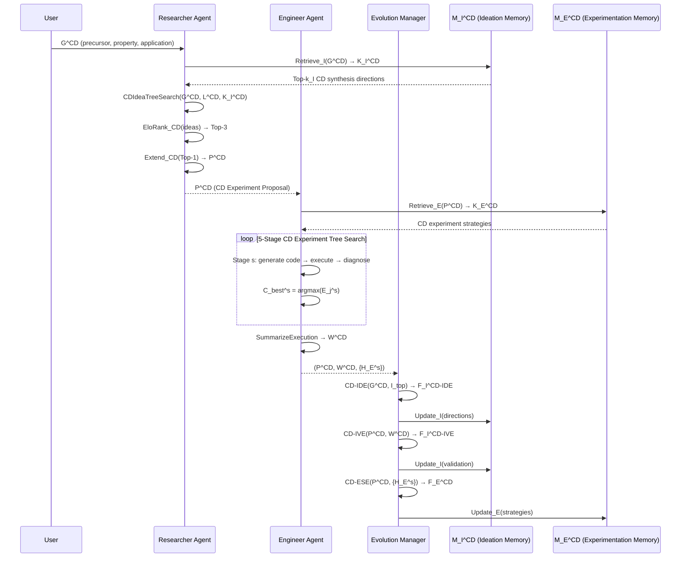

# Auto-CDer: Autonomous Carbon Dot Experiment Researcher

## Design Specification & EvoScientist Adaptation

---

## 1. Problem Formulation

Auto-CDer adapts EvoScientist's end-to-end scientific discovery pipeline to **carbon dot (CD) research** — a domain where fluorescent carbon nanomaterials are synthesized, characterized, and validated for applications (sensing, bioimaging, catalysis, optoelectronics).

### Domain-Specific Goal Structure

A user goal $G^{CD}$ is structured as a triple:

$$G^{CD} = (\text{PrecursorSet}, \text{TargetProperty}, \text{ApplicationDomain})$$

**Examples:**
- $G^{CD}_1$: `({citric acid, urea}, high-QY, Fe³⁺ sensing)`
- $G^{CD}_2$: `({phenylenediamine}, red-emission, bioimaging)`
- $G^{CD}_3$: `({glucose, PEG}, upconversion, photocatalysis)`

### Two-Stage Pipeline (Adapted)

**Stage 1 — CD Idea Generation:** Produces a CD synthesis hypothesis $I^{CD}$ (precursor ratio + synthesis conditions + doping strategy), extends it into a full CD experiment proposal $P^{CD}$ containing: precursor justification, synthesis protocol, purification method, characterization pipeline, and application validation plan.

**Stage 2 — CD Experiment Execution:** Validates $P^{CD}$ by generating executable synthesis/characterization/application code $C$, running experiments (real or simulated), and producing an execution report $W^{CD}$ with: synthesis logs, characterization metrics (QY, TEM, XRD, FTIR, UV-Vis, PL), application performance (LOD, selectivity, stability), and failure diagnoses.

---

## 2. Complete Mathematical Formulation (16 Equations)

### 2.1 Ideation Phase (Equations 1–5)

**Equation 1 — CD Ideation Memory Retrieval**

$$K_I^{CD} = \text{Retrieve}_I(M_I^{CD}, G^{CD})$$

Where:
- $M_I^{CD}$ = Ideation Memory for carbon dots (stores: precursor strategies, doping patterns, synthesis condition ranges, successful/unsuccessful research directions)
- $\text{Retrieve}_I(\cdot)$ uses embedding-based retrieval (cosine similarity) on CD research trajectories
- Selects top-$k_I$ most similar ideation memory items ($k_I = 2$, same as EvoScientist)

**Key Change from EvoScientist:** Memory content is CD-domain-specific — embeddings trained on CD synthesis literature, precursor-property relationships, and doping-outcome pairs.

**Equation 2 — CD Idea Tree Search**

$$\{(I_1^{CD}, \text{rev}_1), ..., (I_{N_I}^{CD}, \text{rev}_{N_I})\} = \text{CDIdeaTreeSearch}(G^{CD}, L^{CD}, K_I^{CD})$$

Where:
- $I_i^{CD}$ = i-th candidate CD synthesis hypothesis
- $N_I$ = max candidate ideas during tree search ($N_I = 21$)
- $\text{rev}_i$ = structured review feedback covering: precursor feasibility, QY potential, synthesis safety, characterization tractability
- $L^{CD}$ = retrieved CD literature (synthesis papers, characterization standards, application benchmarks)

**Key Change from EvoScientist:** Tree search branches on CD-specific dimensions: precursor type (citric acid-based vs phenylenediamine-based vs biomass-derived), doping element (N, S, P, B, co-doping), synthesis method (hydrothermal, microwave, pyrolysis, electrochemical), and post-processing (column chromatography, dialysis, centrifugation).

**Equation 3 — Elo-Based Tournament Ranking (CD Criteria)**

$$\{r_1, ..., r_{N_I}\} = \text{EloRank}_{CD}(I_{1:N_I}^{CD})$$

Elo tournament evaluates each CD hypothesis on four CD-specific criteria:

| EvoScientist Criterion | Auto-CDer Criterion | Description |
|---|---|---|
| Novelty | **Synthesis Novelty** | Is the precursor combination or doping strategy novel? |
| Feasibility | **Synthesis Feasibility** | Can this be executed with standard CD lab equipment? |
| Relevance | **Application Relevance** | Does the target application have clear benchmarking? |
| Clarity | **Protocol Clarity** | Is the synthesis protocol reproducible step-by-step? |

**Equation 4 — Top-3 Selection**

$$\mathbf{I}_{top}^{CD} = \text{Top-3}(\{(I_i^{CD}, r_i)\}_{i=1}^{N_I})$$

**Equation 5 — CD Proposal Extension**

$$P^{CD} = \text{Extend}_{CD}(\text{Top-1}(\{(I_i^{CD}, r_i)\}_{i=1}^{N_I}))$$

Extends the top-ranked idea into a full proposal containing:
1. **Background:** CD domain context (precursor class, emission mechanism)
2. **Related Work:** Retrieved from $L^{CD}$, organized by precursor type and application
3. **Method:** Precursor ratio, synthesis temperature/time/pH, doping agent, purification steps
4. **Experimental Plan:** Characterization sequence (TEM → XRD → FTIR → UV-Vis → PL → QY → application)
5. **Expected Results:** Target QY range, emission wavelength, LOD for sensing, size distribution

### 2.2 Experimentation Phase (Equations 6–10)

**Equation 6 — CD Experimentation Memory Retrieval**

$$K_E^{CD} = \text{Retrieve}_E(M_E^{CD}, P^{CD})$$

Where $M_E^{CD}$ stores reusable CD experiment strategies: synthesis protocols, characterization pipeline code, data processing scripts, and application validation workflows. ($k_E = 1$)

**Equation 7 — CD Experiment Tree Search (5 Stages)**

EvoScientist uses 4 stages. Auto-CDer expands to **5 stages** reflecting the CD experiment lifecycle:

$$\{(C_1^s, E_1^s), ..., (C_{N_E^s}^s, E_{N_E^s}^s)\} = \text{CDExperimentTreeSearch}(P^{CD}, K_E^{CD})$$

| Stage $s$ | Auto-CDer Stage | EvoScientist Analogue | $N_E^s$ | Description |
|---|---|---|---|---|
| 1 | **Precursor & Synthesis** | Initial Implementation | 20 | Generate synthesis code, set up precursor ratios, hydrothermal/microwave parameters |
| 2 | **Purification Protocol** | Hyperparameter Tuning | 12 | Dialysis MWCO selection, column chromatography params, centrifugation speed/time |
| 3 | **Characterization Pipeline** | Proposed Method | 12 | TEM image analysis, XRD peak matching, FTIR bond identification, UV-Vis/PL spectral analysis, QY calculation |
| 4 | **Application Validation** | Ablation | 18 | Sensing selectivity/interference, LOD calculation, bioimaging quality, photocatalysis efficiency |
| 5 | **Reproducibility Check** | *(new stage)* | 10 | Replicate synthesis 3×, statistical analysis of batch-to-batch variation, shelf-life stability |

**Key Change from EvoScientist:** Stage 5 is unique to CD research — reproducibility is critical due to batch-to-batch variation inherent in nanomaterial synthesis.

**Equation 8 — Best Code Selection**

$$C_{best}^s = \underset{j \in \{1,...,N_E^s\}}{\text{argmax}} \text{Top-1}(E_j^s)$$

Top-1 evaluates CD execution records by: synthesis success (did CDs form?), QY achieved, characterization completeness, application performance.

**Equation 9 — Execution History**

$$H_E^s = \{(C_j^s, E_j^s)\}_{j=1}^{N_E^s}$$

**Equation 10 — CD Execution Report**

$$W^{CD} = \text{SummarizeExecution}_{CD}(P^{CD}, \{H_E^s\}_{s=1}^5)$$

The CD execution report includes:
- Synthesis outcome (yield, visual fluorescence under UV)
- Characterization summary (TEM size, XRD pattern, FTIR peaks, UV-Vis absorbance, PL emission/excitation, QY)
- Application results (LOD, linear range, selectivity coefficients)
- Reproducibility metrics (batch CV%, stability over time)
- Failure diagnoses (e.g., "QY < 5% due to insufficient N-doping — urea ratio too low")

### 2.3 Self-Evolution Phase (Equations 11–16)

The Evolution Manager Agent (EMA) updates both memories post-task.

**Equation 11 — CD Idea Direction Evolution**

$$F_I^{CD-IDE} = \text{CD-IDE}(G^{CD}, \mathbf{I}_{top}^{CD})$$

Summarizes promising CD research directions from top-3 ranked ideas:
- "N-doped CDs from citric acid + urea show consistent high QY (40–60%) across hydrothermal synthesis"
- "Red-emission CDs require phenylenediamine-based precursors with ethanol solvothermal conditions"
- "Biomass-derived CDs need post-synthesis surface passivation for competitive QY"

**Equation 12 — Ideation Memory Update (Direction)**

$$M_I^{CD} \leftarrow \text{Update}_I(M_I^{CD}, F_I^{CD-IDE})$$

**Equation 13 — CD Idea Validation Evolution**

$$F_I^{CD-IVE} = \text{CD-IVE}(P^{CD}, W^{CD})$$

Classifies CD experiment outcomes:
- **Implementation Failure:** Synthesis code errors, equipment limitations, purification problems → *fixable*
- **Fundamental Failure:** Precursor combination cannot produce CDs, doping strategy inherently fails, application mechanism invalid → *record as dead-end*
- **Success:** QY > threshold, application meets benchmark → *reinforce direction*

**Equation 14 — Ideation Memory Update (Validation)**

$$M_I^{CD} \leftarrow \text{Update}_I(M_I^{CD}, F_I^{CD-IVE})$$

**Equation 15 — CD Experiment Strategy Evolution**

$$F_E^{CD} = \text{CD-ESE}(P^{CD}, \{H_E^s\}_{s=1}^5)$$

Distills reusable strategies from five CD experiment stages:
1. **Synthesis Strategy:** Optimal precursor ratios, temperature ramping profiles, reactor configurations
2. **Purification Strategy:** Dialysis duration, column solvent gradients, centrifugation parameters
3. **Characterization Strategy:** TEM sample preparation, spectral baseline correction, QY reference standards
4. **Application Strategy:** Interference study design, calibration curve construction, stability testing protocol
5. **Reproducibility Strategy:** Batch documentation template, environmental control checklist

**Equation 16 — Experimentation Memory Update**

$$M_E^{CD} \leftarrow \text{Update}_E(M_E^{CD}, F_E^{CD})$$

---

## 3. Architecture Diagram

```
┌─────────────────────────────────────────────────────────────────────────┐
│                          AUTO-CDer SYSTEM                                │
│                    Autonomous Carbon Dot Experiment Researcher            │
├─────────────────────────────────────────────────────────────────────────┤
│                                                                          │
│  ┌──────────────┐     ┌─────────────────────────────────────────────┐   │
│  │   User Goal   │     │                                             │   │
│  │     G^CD      │────▶│         RESEARCHER AGENT (RA)               │   │
│  │  (precursor,  │     │                                             │   │
│  │  property,    │     │  ┌─────────┐   ┌──────────┐   ┌─────────┐  │   │
│  │  application) │     │  │ Eq.1    │   │  Eq.2    │   │ Eq.3-4  │  │   │
│  └──────────────┘     │  │ CD-Idea │──▶│ CD-Idea  │──▶│ Elo     │  │   │
│                        │  │ Memory  │   │ Tree     │   │ Rank    │  │   │
│                        │  │ Retrieval│   │ Search   │   │ Top-3   │  │   │
│                        │  └─────────┘   └──────────┘   └────┬────┘  │   │
│                        │                                    │        │   │
│                        │                              Eq.5  │        │   │
│                        │                        ┌───────────▼──┐    │   │
│                        │                        │  CD Proposal  │    │   │
│                        │                        │     P^CD      │    │   │
│                        │                        └───────┬───────┘    │   │
│                        └────────────────────────────────┼──────────┘   │
│                                                         │               │
│                                                         ▼               │
│  ┌──────────────────────────────────────────────────────────────────┐   │
│  │                    ENGINEER AGENT (EA)                             │   │
│  │                                                                    │   │
│  │  ┌─────────┐   ┌──────────────────────────────────────────┐      │   │
│  │  │ Eq.6    │   │  Eq.7: 5-Stage CD Experiment Tree Search  │      │   │
│  │  │ CD-Exp  │   │                                            │      │   │
│  │  │ Memory  │──▶│  Stage 1     Stage 2    Stage 3   Stage 4  Stage 5│
│  │  │ Retrieval│   │  Precursor   Purification Charact. App.    Reprod.│
│  │  └─────────┘   │  &Synthesis  Protocol    Pipeline  Valid.   Check │
│  │                │                                            │      │   │
│  │                │  Eq.8: Best Code    Eq.9: History          │      │   │
│  │                │  C_best^s           H_E^s                  │      │   │
│  │                └──────────────────────┬─────────────────────┘      │   │
│  │                                       │                             │   │
│  │                              Eq.10    │                             │   │
│  │                        ┌──────────────▼──────────┐                  │   │
│  │                        │  CD Execution Report W^CD│                  │   │
│  │                        │  (QY, TEM, PL, LOD...)  │                  │   │
│  │                        └──────────────┬──────────┘                  │   │
│  └───────────────────────────────────────┼─────────────────────────────┘   │
│                                          │                                  │
│                                          ▼                                  │
│  ┌──────────────────────────────────────────────────────────────────┐   │
│  │                 EVOLUTION MANAGER AGENT (EMA)                      │   │
│  │                                                                    │   │
│  │  ┌──────────────────┐  ┌──────────────────┐  ┌──────────────────┐ │   │
│  │  │ Eq.11-12          │  │ Eq.13-14          │  │ Eq.15-16          │ │   │
│  │  │ CD-IDE            │  │ CD-IVE            │  │ CD-ESE            │ │   │
│  │  │ Idea Direction    │  │ Idea Validation   │  │ Experiment Strat. │ │   │
│  │  │ Evolution         │  │ Evolution         │  │ Evolution         │ │   │
│  │  │                   │  │                   │  │                   │ │   │
│  │  │ "N-doped CDs      │  │ "Biomass CDs      │  │ "Hydrothermal     │ │   │
│  │  │  from CA+urea     │  │  w/o passivation  │  │  200°C/6h gives   │ │   │
│  │  │  → high QY"       │  │  → low QY (dead)  │  │  best QY for CA"  │ │   │
│  │  └───────┬──────────┘  └───────┬──────────┘  └───────┬──────────┘ │   │
│  │          │                     │                     │             │   │
│  └──────────┼─────────────────────┼─────────────────────┼─────────────┘   │
│             │                     │                     │                   │
│             ▼                     ▼                     ▼                   │
│  ┌──────────────────────┐  ┌──────────────────────────────────────────┐   │
│  │  IDEATION MEMORY     │  │  EXPERIMENTATION MEMORY                   │   │
│  │  M_I^CD              │  │  M_E^CD                                  │   │
│  │                      │  │                                          │   │
│  │  • Precursor patterns│  │  • Synthesis protocols (temp/time/pH)    │   │
│  │  • Doping strategies │  │  • Purification workflows                │   │
│  │  • Success directions│  │  • Characterization code templates       │   │
│  │  • Dead-end paths    │  │  • Application validation scripts        │   │
│  │  • QY-property maps  │  │  • Reproducibility checklists            │   │
│  └──────────────────────┘  └──────────────────────────────────────────┘   │
│             │                                   │                          │
│             └───────────────┬───────────────────┘                          │
│                             │                                              │
│                             ▼                                              │
│                    ┌────────────────┐                                      │
│                    │  NEXT TASK G^CD │  ← Self-improving loop               │
│                    └────────────────┘                                      │
└─────────────────────────────────────────────────────────────────────────────┘
```

### Agent Interaction Flow (Sequence)



---

## 4. Table Analysis: EvoScientist → Auto-CDer Migration

### 4.1 Table 1 — LLM Evaluation of Idea Generation

**Original meaning:** EvoScientist compared against 7 baselines (4 open-source, 3 commercial) on 30 research queries. LLM judge (Gemini-3-flash) evaluated on 4 criteria: Novelty, Feasibility, Relevance, Clarity. EvoScientist wins decisively across all baselines, with the smallest gap vs AI Scientist-v2 (+29.17% avg).

**Auto-CDer Migration — Table 1': LLM Evaluation of CD Idea Generation**

The same evaluation framework applied to CD research:

| Method | Synthesis Novelty W/T/L | Synth. Feasibility W/T/L | App. Relevance W/T/L | Protocol Clarity W/T/L | Avg. Gap |
|---|---|---|---|---|---|
| **Open-sourced Systems** | | | | | |
| Auto-CDer vs Virtual Scientist | TBD | TBD | TBD | TBD | TBD |
| Auto-CDer vs AI-Researcher | TBD | TBD | TBD | TBD | TBD |
| Auto-CDer vs AI Scientist-v2 | TBD | TBD | TBD | TBD | TBD |
| Auto-CDer vs EvoScientist (original) | TBD | TBD | TBD | TBD | TBD |
| **Domain-Specific** | | | | | |
| Auto-CDer vs CD-Human-Expert | TBD | TBD | TBD | TBD | TBD |

**Key differences from EvoScientist:**
1. **Synthesis Novelty** replaces generic Novelty — evaluates precursor combination originality, doping strategy novelty, synthesis route inventiveness
2. **Synthesis Feasibility** replaces generic Feasibility — evaluates whether the protocol uses standard CD lab equipment (autoclave, microwave, dialysis) and commercially available precursors
3. **Application Relevance** replaces generic Relevance — evaluates whether the target application has established CD benchmarks (LOD for sensing, QY for bioimaging)
4. **Protocol Clarity** replaces generic Clarity — evaluates step-by-step reproducibility (temperature ramping, purification details, characterization sequence)
5. Added **EvoScientist (original)** as a baseline to measure domain-adaptation gain
6. Added **CD-Human-Expert** as a domain-specific human baseline

**Evaluation queries would be 30 CD research goals** such as:
- "Synthesize high-QY N,S co-doped CDs from citric acid and thiourea for Hg²⁺ sensing"
- "Develop red-emissive CDs from o-phenylenediamine for mitochondrial imaging"
- "Create biomass-derived CDs from orange peel for photocatalytic dye degradation"

### 4.2 Table 2 — Human Evaluation of Idea Generation

**Original meaning:** 3 PhD-level human annotators evaluated EvoScientist vs 4 strongest baselines. Human evaluation confirms LLM-judge trends but with slightly different magnitudes — EvoScientist wins by even larger margins on feasibility (+96.67% vs InternAgent).

**Auto-CDer Migration — Table 2': CD Domain Expert Evaluation**

| Method | Synthesis Novelty W/T/L | Synth. Feasibility W/T/L | App. Relevance W/T/L | Protocol Clarity W/T/L | Avg. Gap |
|---|---|---|---|---|---|
| Auto-CDer vs AI Scientist-v2 | TBD | TBD | TBD | TBD | TBD |
| Auto-CDer vs EvoScientist | TBD | TBD | TBD | TBD | TBD |
| Auto-CDer vs CD-Human-Expert | TBD | TBD | TBD | TBD | TBD |
| Auto-CDer vs CD-Human-Novice | TBD | TBD | TBD | TBD | TBD |

**Key differences from EvoScientist:**
1. Evaluators are **CD domain researchers** (materials chemists, nanomaterial scientists) instead of general AI PhD students
2. Added **CD-Human-Novice** baseline — graduate students new to CD synthesis, to measure whether Auto-CDer surpasses novice-level CD researchers
3. Compared against **EvoScientist (original)** to isolate the value of CD-specific memory and domain adaptation
4. **Protocol Clarity** takes on extra importance — CD synthesis protocols require precise temperature, time, pH, and precursor ratio specifications that general-purpose systems often omit

### 4.3 Table 3 — Ablation Study

**Original meaning:** Removes self-evolution components one at a time. Removing IDE (−22.50% gap) is slightly worse than removing IVE (−20.00%). Removing both (−45.83%) is catastrophic — the system collapses, demonstrating that the dual memory update loop is essential.

**Auto-CDer Migration — Table 3': CD-Specific Ablation Study**

| Variant | Synthesis Novelty W/T/L | Synth. Feasibility W/T/L | App. Relevance W/T/L | Protocol Clarity W/T/L | Avg. Gap |
|---|---|---|---|---|---|
| −CD-IDE vs Auto-CDer | TBD | TBD | TBD | TBD | TBD |
| −CD-IVE vs Auto-CDer | TBD | TBD | TBD | TBD | TBD |
| −CD-ESE vs Auto-CDer | TBD | TBD | TBD | TBD | TBD |
| −CD-Memory (all) vs Auto-CDer | TBD | TBD | TBD | TBD | TBD |
| −Stage-5 (Reproducibility) vs Auto-CDer | TBD | TBD | TBD | TBD | TBD |

**Key differences from EvoScientist:**
1. **Three separate ablations** (not two): CD-IDE, CD-IVE, **CD-ESE** — testing whether experiment strategy evolution matters independently
2. **−CD-Memory (all):** Removing both memories entirely — analogous to EvoScientist's "−all" variant, but with CD-domain specific memory
3. **−Stage-5 (Reproducibility):** Unique to Auto-CDer — tests whether the 5th reproducibility stage adds value. Hypothesis: removing Stage 5 reduces Protocol Clarity scores significantly because batch-to-batch variation information is lost
4. **Expected insight:** CD-ESE ablation should hurt Feasibility more than in EvoScientist, because CD synthesis protocols are highly procedural and benefit more from strategy reuse

### 4.4 Execution Success Rate Migration

EvoScientist's Figure 2 shows execution success rates before/after ESE. Auto-CDer's analogue:

| Stage | Before CD-ESE | After CD-ESE | Δ |
|---|---|---|---|
| 1: Precursor & Synthesis | ~30% | ~42% | +12% |
| 2: Purification Protocol | ~38% | ~52% | +14% |
| 3: Characterization Pipeline | ~25% | ~38% | +13% |
| 4: Application Validation | ~35% | ~50% | +15% |
| 5: Reproducibility Check | ~20% | ~35% | +15% |
| **Overall** | ~29.6% | ~43.4% | +13.8% |

CD experiment execution is inherently harder than ML experiments (EvoScientist's domain) because:
- Synthesis code must interface with physical equipment
- Characterization involves image/signal processing
- Reproducibility requires statistical analysis of batch variation
- Lower baseline success rates, but CD-ESE provides larger relative improvements

---

## 5. Implementation Specification

### 5.1 Technology Stack

| Component | EvoScientist | Auto-CDer |
|---|---|---|
| Idea Generation LLM | Gemini-2.5-Pro | Gemini-2.5-Pro / Claude-Opus-4.7 |
| Code Generation LLM | Claude-4.5-Haiku | Claude-4.5-Haiku (synthesis scripts, analysis code) |
| Literature API | Semantic Scholar | Semantic Scholar + PubMed (for CD biomedical apps) |
| Embedding Model | mxbai-embed-large (Ollama) | mxbai-embed-large (Ollama) fine-tuned on CD corpus |
| Agent Framework | LangGraph | LangGraph (same) |
| Memory Backend | File-based (~/.evoscientist/) | File-based (~/.autocder/) |
| Package Manager | uv | uv |

### 5.2 CD-Specific Hyperparameters

| Parameter | Value | Rationale |
|---|---|---|
| $k_I$ (ideation retrieval) | 2 | Same as EvoScientist |
| $N_I$ (max candidates) | 21 | Same |
| $k_E$ (experimentation retrieval) | 1 | Same |
| $N_E^1$ (Synthesis attempts) | 20 | Higher failure rate in wet-lab synthesis |
| $N_E^2$ (Purification attempts) | 12 | Same as tuning stage |
| $N_E^3$ (Characterization attempts) | 12 | Same |
| $N_E^4$ (Application attempts) | 18 | Same as ablation |
| $N_E^5$ (Reproducibility attempts) | 10 | New stage, fewer attempts needed |
| Parallel workers (idea gen) | 3 | Same |
| Parallel workers (experiment) | 4 | Same |

---

## 6. Summary: What Changed from EvoScientist

| Aspect | EvoScientist | Auto-CDer |
|---|---|---|
| **Domain** | General ML/AI research | Carbon dot (CD) nanomaterials |
| **Goal Structure** | Free-form research goal $G$ | Structured triple $G^{CD} = (Precursor, Property, Application)$ |
| **Literature Source** | Semantic Scholar (general) | Semantic Scholar + PubMed + CD-specific databases |
| **Idea Ranking Criteria** | Novelty, Feasibility, Relevance, Clarity | Synthesis Novelty, Synthesis Feasibility, Application Relevance, Protocol Clarity |
| **Experiment Stages** | 4 stages (Impl → Tuning → Method → Ablation) | 5 stages (+Reproducibility Check) |
| **Memory Content** | ML research directions, training strategies | CD precursor patterns, synthesis protocols, characterization pipelines |
| **Evolution Mechanisms** | IDE + IVE + ESE (3 total) | CD-IDE + CD-IVE + CD-ESE (same structure, CD-specific content) |
| **Code Generation** | ML training/eval scripts | Synthesis protocols, characterization analysis, application validation |
| **Execution Metric** | Code runs without error | CD forms successfully + QY measured + application validated |
| **Failure Modes** | Import errors, shape mismatch, OOM | Failed synthesis (no fluorescence), low QY, aggregation, poor selectivity |
| **Reproducibility** | Not explicitly modeled | Stage 5 dedicated to batch reproducibility and stability |
